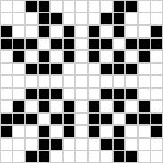
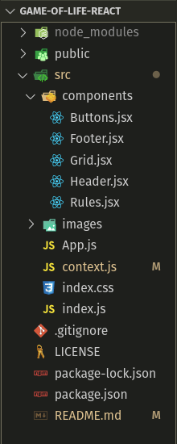

## pag.18 GAME OF LIFE with React Hooks



Conway's Game of Life was one of my first projects while learning JS and I must say, it was challenging. To pay my respects to John Horton Conway (1937-2020) I decided to give it a spin with React using some hooks like useContext, useEffect, useState, useCallback!

# INDEX

1. FIRST PART
   1. Intro
   2. Resources
   3. What will we build
   
2. SECOND PART
   1. React Components
   2. General functions
   3. Core functions
   4. Solving Problems
   5. Conclusions

# 1. FIRST PART 

### 1.1 INTRO

Conway's Game of Life is a cellular automaton devised by the British mathematician John Horton Conway in 1970. It is a zero-player game, meaning that its evolution is determined by its initial state, requiring no further input. One interacts with the Game of Life by creating an initial configuration and observing how it evolves.

### 1.2 RESOURCES

- [Demo](https://to-gol.netlify.app)
- [Github repo](https://github.com/RobertoCastelli)
- [Wiki Conway's Game of Life](https://en.wikipedia.org/wiki/Conway%27s_Game_of_Life)

### 1.3 WHAT WILL WE BUILD


An infinite, two-dimensional orthogonal grid of square cells, each of which is in one of two possible states, live or dead. Every cell interacts with its eight neighbours, which are the cells that are horizontally, vertically, or diagonally adjacent. At each step in time, the following transitions occur:

1. Any live cell with fewer than two live neighbours dies, as if by underpopulation.
2. Any live cell with two or three live neighbours lives on to the next generation.
3. Any live cell with more than three live neighbours dies, as if by overpopulation.
4. Any dead cell with exactly three live neighbours becomes a live cell, as if by reproduction.
   

# 2. SECOND PART

### 2.1 REACT COMPONENTS


- **Buttons** component is dedicated to the user game management like speed, color etc...
```javascript
import React, { useContext } from "react";
import { FaPlay } from "react-icons/fa";
import { FaStop } from "react-icons/fa";
import { GiConwayLifeGlider } from "react-icons/gi";
import { MdReplay } from "react-icons/md";
import { BiShapeTriangle } from "react-icons/bi";
import { DataContext } from "../context";
const Buttons = () => {
  const context = useContext(DataContext);
  const {
    generateRandomCells,
    generatePulsar,
    clearAllGrid,
    runGame,
    isRunning,
    handleSpeed,
    speed,
    cellColor,
    handleCellColor,
  } = context;

  return (
    <div className="controlPanel">
      <div className="buttons">
        <button onClick={runGame}>
          {!isRunning ? <FaPlay size={20} /> : <FaStop size={20} />}
        </button>
        <button onClick={generateRandomCells}>
          <GiConwayLifeGlider size={20} />
        </button>
        <button onClick={generatePulsar}>
          <BiShapeTriangle size={20} />
        </button>
        <button onClick={clearAllGrid}>
          <MdReplay size={20} />
        </button>
      </div>
      <div className="slider">
        <label htmlFor="speed">{speed} ms</label>
        <input
          name="speed"
          type="range"
          min="100"
          max="1000"
          step="100"
          value={speed}
          onChange={(e) => handleSpeed(e.target.value)}
        />
      </div>
      <div>
        <input
          type="color"
          value={cellColor}
          onChange={(e) => handleCellColor(e.target.value)}
        />
      </div>
    </div>
  );
};
export default Buttons;
```

- **Grid** component is where the game is displayed and you custom toggle the single cell state
```javascript
import React, { useContext } from "react";
import Buttons from "./Buttons";
import { DataContext } from "../context";
const Grid = () => {
  const context = useContext(DataContext);
  const { grid, toggleCellState, counter, cellColor } = context;

  return (
    <div className="grid">
      <div className="counter">{counter}</div>
      <div className="grid-wrapper">
        {grid.map((cell, id) => {
          return (
            <div
              id={id}
              key={id}
              className="grid-cell"
              onClick={() => toggleCellState(id)}
              style={
                cell.state
                  ? { backgroundColor: cellColor }
                  : { backgroundColor: "white" }
              }
            ></div>
          );
        })}
      </div>
      <Buttons />
    </div>
  );
};
export default Grid;
```
- **Header, Footer & Rules** components are pretty self explanatory and I won't linger on them  


### 2.2 GENERAL FUNCTIONS  
**context.js** is where all the project logic resides, wrapping everything in the one of my favorites hooks: **useContext**

- reset game clearing all the grid
- generate random cells in the grid
- generate a famous infinite pattern
- toggle single cell state in the grid
- handle the color picker
- handle the speed slider
- handle the game start and stop

```javascript
import React, { useCallback, useEffect, useState } from "react";
//--> CREATE REACT CONTEXT
export const DataContext = React.createContext();

const ContextProvider = (props) => {
  //--> INITIAL GRID WITH ALL CELLS DEAD (STATE FALSE)
  const initialGrid = Array.from({ length: 400 }, () => ({
    state: false,
  }));

  //--> STATES
  const [grid, setGrid] = useState(initialGrid); // UPDATE GRID
  const [cellState, setCellState] = useState(false); // UPDATE CELL STATE (DEAD/ALIVE)
  const [counter, setCounter] = useState(0); // UPDATE NEXT GRID COUNTER
  const [isRunning, setIsRunning] = useState(false); // UPDATE BOOLEAN RUNNING STATE
  const [speed, setSpeed] = useState(100); // UPDATE SLIDER SPEED VALUE
  const [cellColor, setCellColor] = useState("#88d500"); // UPDATE COLOR-PICKER VALUE

  //--> RESET GAME
  const clearAllGrid = () => window.location.reload();

  //--> GENERATE RANDOM CELLS FOR THE LAZY BASTARDS :)
  const generateRandomCells = () => {
    setGrid(
      grid.map(() => {
        return {
          state: Math.random() < 0.5,
        };
      })
    );
  };

  //--> GENERATE PULSAR TO SHOW OFF (optional)
  const generatePulsar = () => {
    setCellState(
      grid.map((cell, id) => {
        [
          248,
          268,
          288,
          250,
          270,
          ... // LIST OF ALIVE CELLS
          163,
          243,
          263,
          283,
        ].includes(id)
          ? (cell.state = true)
          : (cell.state = false);
        return cellState;
      })
    );
  };

  //--> TOGGLE SINGLE CELL STATE (DEAD/ALIVE)
  const toggleCellState = (index) => {
    setCellState(
      grid.map((cell, id) => {
        if (index === id) {
          cell.state = !cell.state;
        }
        return cellState;
      })
    );
  };

  //--> TOGGLE NEXT STEP GRID SPEED
  const handleSpeed = (e) => setSpeed(e);

  //--> SELECT CELL COLOR FROM COLOR-PICKER
  const handleCellColor = (e) => setCellColor(e);

  //--> START/STOP CONWAY's GAME
  const runGame = () => (!isRunning ? setIsRunning(true) : setIsRunning(false));
```

  
### 2.3 CORE FUNCTIONS
always in the context.js we continue setting the core logic creating the next generation grid base on the Conway's rules. In this case we apply useCallback on the main next generation function, and to loop we use the setTimeout method inside the useEffect hook to take advantage of the dependencies and avoid infinite rendering.

```javascript
  /*~~~~~~~~~~~~~~~~~~~~~~~~~~~~~~~~~~~~~~~~~~~~~~~~*\
  ||~~~~~~~~~~~~~~~| CORE MECHANICS |~~~~~~~~~~~~~~~||
  ||~~~~~~~~~~~~~~~~~~~~~~~~~~~~~~~~~~~~~~~~~~~~~~~~||                              
  ||                                                ||
  ||              [ ↖ ]  [ ↥ ]  [ ↗ ]               
  ||              [<- ]  [CELL]  [ ->]              ||             
  ||              [ ↙ ]  [ ↧ ]  [ ↘ ]               
  ||                                                ||
  ||  1. INIT A NEW GRID FROM PREVIOUS GRID         ||
  ||  2. COUNT ALIVE NEIGHBOURS FOR EVERY CELL      ||
  ||  3. APPLY CONWAY's RULES FOR EVERY CELL        ||
  ||  4. POPULATE NEW GRID w/ RESULTING CELLS       ||
  ||  5. UPDATE PREVIOUS GRID w/ NEW GRID           ||
  ||  6. RINSE AND REPEAT (care for infinite loops) ||
  ||                                                ||  
  \*~~~~~~~~~~~~~~~~~~~~~~~~~~~~~~~~~~~~~~~~~~~~~~~~*/

  const nextGrid = useCallback(() => {
    //--> 1. CREATE NEW GRID
    let gridTemp = [...initialGrid];

    //--> 2. COUNT ALIVE NEIGHBOURS FOR EVERY CELL
    grid.map((cell, id) => {
      // ALIVE NEIGHBOURS INIT
      let aliveNeighbours = 0;

      // COUNT NEIGHBOURS AVOIDING TOP-BOTTOM BORDERS (!important)
      if (id >= 21 && id <= 378) {
        grid[id - 1].state && (aliveNeighbours += 1); //  [ ↤ ]
        grid[id + 1].state && (aliveNeighbours += 1); //  [ ↦ ]
        grid[id - 21].state && (aliveNeighbours += 1); // [ ↖ ]
        grid[id - 19].state && (aliveNeighbours += 1); // [ ↗ ]
        grid[id - 20].state && (aliveNeighbours += 1); // [ ↥ ]
        grid[id + 20].state && (aliveNeighbours += 1); // [ ↧ ]
        grid[id + 19].state && (aliveNeighbours += 1); // [ ↙ ]
        grid[id + 21].state && (aliveNeighbours += 1); // [ ↘ ]

      //--> 3. & 4. APPLY CONWAY's RULES & POPULATE NEW GRID
      // any live cell with two or three live neighbours survives. any dead cell
      if (cell.state && (aliveNeighbours === 2 || aliveNeighbours === 3)) {
        gridTemp[id].state = true;
        // SET OPACITY TO THE SURVIVING CELLS
        document.getElementById(id).style.opacity = "0.5";
      }
      // with three live neighbours becomes a live cell. all other live cells die
      if (!cell.state && aliveNeighbours === 3) {
        gridTemp[id].state = true;
        // INCREMENT NEXT STEP COUNTER
        setCounter(counter + 1);
        // SET NO OPACITY TO NEW BORN CELLS
        document.getElementById(id).style.opacity = "1";
      }
      // All other live cells die in the next generation. Similarly, all other dead cells stay dead
      if (cell.state && (aliveNeighbours < 2 || aliveNeighbours >= 4)) {
        gridTemp[id].state = false;
        // AVOIDS WEIRD OPACITY BEHAVIORS 
        document.getElementById(id).style.opacity = "1";
      }
      return cell;
    });
    // --> 5. UPDATE GRID w/ NEW GRID
    setGrid(gridTemp);
  }, [counter, grid, initialGrid]);

  //--> 6. RINSE AND REPEAT
  useEffect(() => {
    if (isRunning) {
      let step = () => nextGrid();
      let timer = setTimeout(step, speed);
      return () => clearTimeout(timer);
    } else {
      return;
    }
  }, [isRunning, nextGrid, speed]);

  //--> RENDER
  return (
    <DataContext.Provider
      value={{
        grid,
        generateRandomCells,
        generatePulsar,
        clearAllGrid,
        toggleCellState,
        runGame,
        counter,
        isRunning,
        speed,
        handleSpeed,
        cellColor,
        handleCellColor,
      }}
    >
      {props.children}
    </DataContext.Provider>
  );
};

export default ContextProvider;
```

### 2.4 SOLVING PROBLEMS
The main problem I encountered was in the useEffect hook. I often occur in re-rendering the infinite loop error. 

I kept changing apporach, but always with nice red errors to handle. The debugging part was crucial since it gave me constant hints and guided me to the solution. It took patient, time and a lot of tweeking to finally solve it!

The final big step was using the useCallback on the core logic that generates the new grid, setting dependencies in the array to avoid the infinite loop. Calling correctly the setTimeout in the useEffect hook was another good practice to make it work.

### 2.5 CONCLUSIONS
I must say, compared to my first JS project, this one was way more fun, linear and readable. Splitting everything in components make things neat and the useContext gives everything a nice touch in terms or clean props reusability

Never give up was the key, I learned a lot from my errors and the reward was fulfilling.
Hope you will find this little guide helpful.

Stay Tuned!

**_Roberto_**